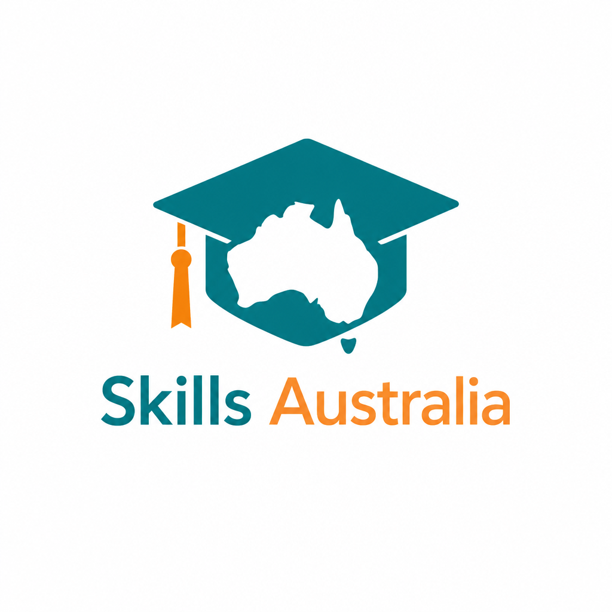

# Skills Australia
## Nepal → Australia New Arrival Support Program

**A Business Plan for Modular Student Settlement & Life-Skills Packages**

*Helping students moving from Nepal to Australia land, settle, and thrive*

**Prepared:** August 2026 · **Status:** Draft for review

**Phone:** 0416 206 568 · **Email:** info@skillsaustralia.com.np

---

> **What we do — and what we don't do**
>
> Skills Australia is an **education and guidance service**. We do **not** give students jobs, driving licences, rental homes, or financial products. We **guide, teach, and prepare** students with practical knowledge, practice tools, checklists, and step-by-step walkthroughs so they can do these things **themselves** in Australia.

---

## Step 1 — Executive Summary

Every year, thousands of students leave Nepal to study in Australia. Most arrive knowing very little about how to **find a job**, how to **apply for a learner permit**, how to **find a room or rent a house**, or how to **navigate everyday life** without getting scammed. This causes stress, wasted money, and missed opportunities in the first few months.

**Skills Australia** offers **modular guidance packages** that students choose based on what they actually need. There is no single forced bundle. One student might only want learner permit quiz practice. Another might want job-search guidance and hospitality support. Families pay for what matters to them.

**Our core focus areas:**
- **How to find a job in Australia** — using Seek and other platforms, writing a proper resume, workplace communication, Australian slang, and interview preparation
- **How to prepare for a learner permit** — practice quiz package in Nepal before arrival (we do not issue licences)
- **How to find housing** — rooms, rentals, leases, bonds, and Nepalese community areas
- **How to navigate Australia safely** — scams, fair work rights, super choice, TFN setup, and second-hand car buying

**Included with every package purchase:**
- **Free Australian SIM card** — included when you enrol in your course (Nepal)
- **Free airport pickup** — collected from the airport on arrival and taken to accommodation
- **City transport card top-up (optional add-on at purchase)** — pre-loaded card for any Australian city
- **SIM activation help in Australia** — we guide students to activate their SIM after landing
- **Practice quiz tools** — topic-based Q&A quizzes so students can test their knowledge before and after classes

**In one sentence:** We turn a confusing, stressful arrival into a guided, choose-what-you-need program — so students land in Australia **informed, prepared, and confident** to find work, housing, and their way around.

---

## Step 2 — The Problem We Solve

| Pain Point | What Goes Wrong | How Skills Australia Guides Students |
|---|---|---|
| Jobs | Don't know Seek, wrong resume format, poor interview English | **Jobs & Career Guide** package |
| Learner permit | Unfamiliar with Australian road rules and test format | **Learner Permit Quiz Ready** package |
| Housing | Can't find rooms, don't understand bond or lease obligations | **Home & Renting Guide** package |
| Hospitality work | No FSA certificate, don't know how to find cookery jobs | **Cookery, Hospitality & FSA** package |
| Workplace rights | Unaware of Fair Work, casual contracts, or super choice | **Work Rights, TFN & Super** package |
| Money & food | Overspend, don't know free food options | **Budget Living & Free Food Tips** package |
| Scams | Fall victim to rental, car, or job scams | **Navigate Australia & Stay Safe** package |
| Transport | Unfamiliar with local transport systems | Transport guidance + optional city transport card |
| Visa points | NAATI CCL feels impossible alone | **NAATI CCL Prep** package |
| Care work | NDIS screening process is confusing | **NDIS & Community Work Guide** package |
| Cleaning work | Don't know standards or how to apply | **Cleaning Jobs Guide** package |

---

## Step 3 — Vision & Target Customers

### Who we serve

- Nepali students with an offer to study in Australia (with future expansion to Canada / UK)
- Families in Nepal who want their children safe and prepared **before** they fly
- Education and migration agents who want a trusted add-on guidance service for their students

### Our promise

- **Simple, plain-language teaching** — no confusing jargon
- **Pick only what you need** — no forced all-in-one enrolment
- **Guidance, not guarantees** — we teach and prepare; students take their own steps in Australia
- **Practical tools** — SIM card, transport card, maps, templates, checklists, and **practice quizzes**
- **Nepal-first, Australia-ready** — preparation starts in Nepal, support continues after arrival

---

## Step 4 — How Skills Australia Works

Students do **not** buy everything at once. They browse packages, enrol in Nepal, and add more packages later if they want.

### Three phases

**Phase 1 — Before You Fly (Nepal)**
- Browse packages and enrol in chosen package(s)
- Attend online guidance classes
- Use **practice quiz tools** to test knowledge (road rules, job tips, renting, scams, etc.)
- Start FSA certificate preparation in Nepal (if enrolled in hospitality package)

**Phase 2 — Travel Day**
- Pack with confidence
- Know exactly what to do on landing

**Phase 3 — After Arrival (Australia)**
- **Free airport pickup** — met at the airport and taken to accommodation
- **SIM activation help** — we guide students to activate the SIM included with their course
- Collect pre-loaded city transport card (if purchased as optional add-on)
- Get to know local transport and secure your city transport card
- Apply learner permit test with confidence (if quiz package completed)
- Use job-search and housing guides independently
- Add more packages anytime

### What every paying student gets (regardless of package)

| Perk | Details |
|---|---|
| **Free SIM card** | Included when you enrol in your course in Nepal |
| **SIM activation help** | We guide students to activate their SIM after arriving in Australia |
| **Free airport pickup** | Met at the airport on arrival and taken directly to accommodation — no need to navigate public transport on day one |
| **Transport card top-up (optional add-on at purchase)** | City transport card pre-loaded for any Australian city — ready to tap |
| **City transport map booklet** | Printed + digital maps for the student's destination city |
| **Practice quiz access** | Topic quizzes matching enrolled packages — practice anytime |
| **Orientation welcome session** | Short overview of first 48 hours in Australia |

---

## Step 5 — Our Packages (Choose What You Need)

Students enrol in **one or more packages**. Each package is self-contained with guidance classes, materials, and practice tools.

**Remember:** We guide and prepare — we do not provide jobs, licences, homes, or financial products.

---

### Package 1 — Learner Permit Quiz Ready
**Best for:** Students who want to pass the Australian learner permit theory test soon after arrival

| Module | What the Student Gets |
|---|---|
| Australian Road Rules Explained | Road signs, speed limits, giving way, safe distances — in plain language |
| Learner Permit Application Guide | How to apply for a learner permit in Australia — steps, documents, what to expect |
| **Practice Quiz Package** | Unlimited practice quizzes in the same style as the real learner permit test — complete in Nepal before flying |
| Test-Day Tips | What to bring, what to expect at the testing centre |

**Format:** Online classes in Nepal + self-paced quiz practice tool

**Includes:** Quiz access until pass-ready · road rules booklet · application checklist

**Important:** We do **not** issue driving licences. We prepare students to pass the learner permit quiz themselves.

---

### Package 2 — Jobs & Career Guide
**Best for:** Students who need to understand how to find work in Australia

| Module | What the Student Gets |
|---|---|
| How to Find Jobs on Seek & Other Platforms | Step-by-step guide to Seek, Indeed, LinkedIn, and student-friendly job boards |
| Australian Resume & Cover Letter | Templates and feedback — what Australian employers actually look for |
| Workplace Communication | Australian communication standards, polite phrases, phone calls, emails |
| Australian Slang & Workplace English | Common slang, workplace expressions, and cultural communication norms |
| Interview Preparation | Common questions, how to answer, mock interview practice |
| **Practice Quiz Tool** | Q&A quizzes on job search tips, resume basics, and interview scenarios |

**Format:** Online workshops with downloadable templates

**Includes:** Resume template pack · Seek search guide · interview question bank · quiz access

**Important:** We do **not** give students jobs. We guide them to search, apply, and communicate effectively.

---

### Package 3 — Home & Renting Guide
**Best for:** Students who need to find a room, rent safely, and understand lease obligations

| Module | What the Student Gets |
|---|---|
| Finding a Room vs Renting a House | Difference between shared rooms, units, and full leases |
| How to Apply for Rentals | Documents needed, references, using realestate.com.au and Domain |
| Understanding Bonds & Lease Obligations | What a bond is, tenant rights, lease terms, what to check before signing |
| Things to Consider Before Leasing | Inspection checklist, red flags, condition reports |
| Good Areas to Live & Nepalese Communities | Suburbs with good transport, safety, and Nepalese community presence by city |
| Rental Scam Awareness | How to spot fake listings, bond fraud, and deposit scams |
| **Practice Quiz Tool** | Q&A on renting terms, bonds, tenant rights, and scam spotting |

**Format:** Online classes + document checklists + area guides

**Includes:** Rental checklist · bond explainer · suburb/community guide · scam red-flag card

**Important:** We do **not** find or provide housing. We guide students to search and apply safely.

---

### Package 4 — Cookery, Hospitality & FSA
**Best for:** Students targeting hospitality, café, restaurant, or cookery roles

| Module | What the Student Gets |
|---|---|
| How to Find Hospitality & Cookery Jobs | Where to look, what employers want, trial shift tips |
| Australian Kitchen Work Environment | Pace, hygiene standards, team structure, uniforms, what to expect |
| FSA Certificate — Complete Guidance | Full walkthrough to obtain a Food Safety Authority (FSA) certificate — **including starting preparation in Nepal** |
| Cookery Job Application Guide | Resume tweaks for kitchen roles, where to apply, what skills to highlight |
| **Practice Quiz Tool** | Food safety and hospitality workplace Q&A practice |

**Format:** Online classes + FSA enrolment guidance (Nepal and Australia pathways)

**Includes:** FSA study guide · certificate provider comparison · hospitality job search guide

**Important:** We guide students through the FSA process — we do not employ them or guarantee job placement.

---

### Package 5 — Cleaning Jobs Guide
**Best for:** Students who want entry-level cleaning work

| Module | What the Student Gets |
|---|---|
| Cleaning Work Standards | Products, safety, time expectations, commercial vs residential |
| Equipment & PPE Guide | What to bring, what employers supply, WH&S basics |
| How to Find Cleaning Jobs | Agencies, direct employers, ABN vs employee work, pay rates overview |
| Application Walkthrough | Resume tweaks for cleaning roles, trial day preparation |
| **Practice Quiz Tool** | Cleaning standards and job application Q&A |

**Format:** Online workshop + practical checklist

**Includes:** Cleaning job checklist · equipment list · application guide

---

### Package 6 — NAATI CCL Prep
**Best for:** Students who want visa points or interpreter work using Nepali language skills

| Module | What the Student Gets |
|---|---|
| Test Format Mastery | Full breakdown of NAATI CCL dialogue structure |
| Practice Dialogues | Health, legal, and community topic practice |
| Exam Strategy | Vocabulary lists, timing tips, mock test feedback |
| **Practice Quiz Tool** | Dialogue vocabulary and exam format Q&A |

**Format:** Online group classes + solo practice materials

**Includes:** Dialogue recordings · vocabulary booklet · exam-day checklist

---

### Package 7 — NDIS & Community Work Guide
**Best for:** Students interested in disability support, aged care, or community services

| Module | What the Student Gets |
|---|---|
| NDIS Worker Screening Walkthrough | Who needs it, documents required, step-by-step online application |
| Identity Verification Guide | Avoid delays — address history, ID, visa evidence |
| Community Care Job Pathways | Entry roles, providers, what to expect — **guidance only** |
| **Practice Quiz Tool** | NDIS screening steps and document checklist Q&A |

**Format:** Detailed online workshop with document preparation support

**Includes:** NDIS application checklist · document template · provider overview guide

---

### Package 8 — Work Rights, TFN & Super
**Best for:** Students who want to understand their rights and obligations when working in Australia

| Module | What the Student Gets |
|---|---|
| Applying for a TFN | What a Tax File Number is, how to apply, documents needed, step-by-step walkthrough |
| Choosing the Right Super Fund | What superannuation is, how to compare funds, how to avoid duplicate accounts — **guidance only, not financial advice** |
| Employment Contracts Explained | Part-time vs casual vs full-time — what to look for before signing |
| Fair Work & Your Rights | Minimum wage awareness, payslip reading, what to do if something goes wrong at work |
| Workplace Issues & Insurance Basics | Fair Work Commission overview, workplace safety, basic insurance awareness |
| **Practice Quiz Tool** | TFN, super, contract types, and Fair Work rights Q&A |

**Format:** Online class with plain-language examples and checklists

**Includes:** TFN application guide · super comparison sheet · contract checklist · Fair Work rights card

**Important:** We do **not** provide investment advice. We help students understand super choice and workplace rights.

---

### Package 9 — Budget Living & Free Food Tips
**Best for:** Students on a tight budget who want to spend less and eat well

| Module | What the Student Gets |
|---|---|
| How to Save Money After Arriving | First-month spending traps, budgeting basics, things to consider after landing |
| **Free Food Tips in Australia** | Salvation Army, Foodbank, community kitchens, church meals — **who provides free food and how to access it** |
| Cheap Food & Supermarket Savings | Discount timing, student meal deals, bulk buying, budget meal planning |
| **Practice Quiz Tool** | Budget tips and free food resource Q&A |

**Format:** Online class + printed/digital resource map

**Includes:** Free food provider map (Salvation Army, Foodbank, community orgs) · budget meal plan · supermarket discount calendar

---

### Package 10 — Navigate Australia & Stay Safe
**Best for:** Students who want to avoid scams and make smart decisions after arrival

| Module | What the Student Gets |
|---|---|
| Common Scams in Australia | Rental scams, job scams, phone scams, myGov/ATO impersonation |
| Buying a Second-Hand Car Safely | How to inspect a car, rego checks, avoiding dodgy sellers, private sale red flags |
| General Safety & Awareness | Staying safe online, verifying people and businesses, when to walk away |
| **Practice Quiz Tool** | Scam spotting and car-buying safety Q&A |

**Format:** Online workshop + printable safety checklists

**Includes:** Scam red-flag guide · second-hand car inspection checklist · safety tips card

---

## Step 6 — Package Comparison at a Glance

| Package | Best Started In | After Arrival | What Student Can Do Themselves |
|---|---|---|---|
| **Learner Permit Quiz Ready** | Nepal | Sit learner permit test | Pass theory test with confidence |
| **Jobs & Career Guide** | Nepal | Search & apply independently | Find and apply for jobs on Seek |
| **Home & Renting Guide** | Nepal | Search for rooms/rentals | Apply for housing safely |
| **Cookery, Hospitality & FSA** | Nepal | Complete FSA + apply for jobs | Pursue hospitality work |
| **Cleaning Jobs Guide** | Nepal | Apply for cleaning roles | Find cleaning work independently |
| **NAATI CCL Prep** | Nepal | Sit NAATI test | Attempt NAATI with preparation |
| **NDIS & Community Work Guide** | Nepal | Submit screening application | Apply for care sector roles |
| **Work Rights, TFN & Super** | Nepal or Australia | Work with confidence | Apply for TFN, choose super, know rights |
| **Budget Living & Free Food Tips** | Nepal or Australia | Live on a budget | Access Salvation Army, Foodbank, and community free food |
| **Navigate Australia & Stay Safe** | Nepal or Australia | Stay safe daily | Avoid scams, buy car safely |

**All packages include:** Free SIM card on enrol · **free airport pickup** · SIM activation help in Australia · optional city transport card top-up at purchase · city map booklet · practice quiz access

---

## Step 7 — Optional Extra Add-On Packages

Add these to any main package at enrolment — pick only what you need:

| Add-On | What the Student Gets |
|---|---|
| **LinkedIn Profile** | Setup and optimisation for Australian job search |
| **Professional Resume** | Premium review and feedback |
| **City Transport Card Top-Up** | Optional pre-loaded card for any Australian city |
| **One-on-One Career Coaching** | Personal session with a career guide |
| **NAATI Fast-Track Revision** | Intensive revision before exam day |
| **Airport Pickup Plus** | Extended pickup with accommodation orientation guide |

---

## Step 8 — Suggested Package Bundles (Optional — for marketing only)

Students still choose individual packages. These are **suggested combinations** — not forced enrolment.

| Bundle Name | Packages Included | Ideal For |
|---|---|---|
| **Job Hunter** | Jobs & Career Guide + one industry guide (Cookery, Cleaning, or NDIS) | Students focused on finding work fast |
| **Arrival Ready** | Home & Renting Guide + Budget Living + Navigate & Stay Safe | First-time travellers |
| **Drive & Work** | Learner Permit Quiz Ready + Work Rights, TFN & Super | Students planning to drive and work |
| **Visa Points Plus** | NAATI CCL Prep + Jobs & Career Guide | PR pathway focused students |
| **Full Preparation** | Any 4+ packages of student's choice | Families wanting broad preparation |

---

## Step 9 — Student Journey (Step by Step)

### For the student

| Step | Action | Where |
|---|---|---|
| **1** | Receive Australian study offer | Nepal |
| **2** | Contact Skills Australia or a partner agent | Nepal |
| **3** | Browse packages — choose only what is needed | Online / in person |
| **4** | Enrol and pay — SIM included with your course | Online / in person |
| **5** | Attend online guidance classes for enrolled packages | Nepal |
| **6** | Complete practice quizzes and receive guides/checklists | Online |
| **7** | Fly to Australia with confidence | Travel |
| **8** | Free airport pickup + SIM activation help | Australia |
| **9** | Get to know local transport and secure your city transport card | Australia |
| **10** | Apply for learner permit, jobs, housing — add packages anytime | Australia / Online |

### For the family

| Step | What Families See |
|---|---|
| **1** | Clear package list — no hidden extras |
| **2** | Plain-language summaries in Nepali and English |
| **3** | Progress updates as their child completes modules and quizzes |
| **4** | Proof of practical readiness before the flight |

---

## Step 10 — Why Families Will Choose Skills Australia

1. **Modular, not overwhelming** — pay only for the guidance packages needed
2. **Honest and clear** — we guide and prepare; we don't make false promises about jobs or licences
3. **Starts before departure** — quiz practice and classes begin in Nepal
4. **Practical tools** — SIM included on enrol, **free airport pickup**, SIM activation help, optional city transport card, practice quizzes, checklists
5. **Job-focused guidance** — Seek, resume, communication, slang, hospitality, cleaning, and NDIS pathways
6. **Safety-first** — scam awareness, rental red flags, dodgy car seller warnings, Fair Work rights
7. **Simple language** — easy to follow in Nepali and English
8. **Agent-friendly** — education partners can offer Skills Australia as a trusted add-on

---

## Step 11 — Launch Roadmap

| Step | Action | Notes |
|---|---|---|
| **1** | Register **Skills Australia** (Nepal + Australia if needed) | Confirm legal structure; education/guidance service boundaries |
| **2** | Finalise package pricing and bundle discounts | Include quiz platform, SIM/card supplier costs |
| **3** | Build practice quiz platform | Topic quizzes for each package |
| **4** | Set up telecom & transport card supplier deals | Bulk SIM on enrol; city transport card partnerships |
| **5** | Partner with FSA certificate providers (Nepal + Australia) | For hospitality package |
| **6** | Build online enrolment system + classroom (Zoom/Google Meet) | Package selection, payment, quiz access |
| **7** | Create package booklets (PDF) for each module | Printable guides for families |
| **8** | Recruit trainers | Career coach, NAATI tutor, hospitality trainer, settlement guide |
| **9** | Pilot with 10–15 students across 3–4 packages | Collect feedback before scaling |
| **10** | Launch via agents, social media, and Nepali community groups | Phone: 0416 206 568 · Email: info@skillsaustralia.com.np |

---

## Step 12 — Legal & Compliance Note

> **Important:** Skills Australia provides **general education and practical orientation only**. We do **not** guarantee employment, issue driving licences, provide housing, give financial or investment advice, or act as migration agents. Students must confirm all official requirements (visa conditions, learner permit, NAATI, ATO, NDIS Worker Screening, superannuation choice, FSA certification) directly with the relevant Australian government body or a licensed professional.

---

## Step 13 — Next Document Versions (To Add)

- [ ] Pricing per package and bundle discount tiers
- [ ] Staffing plan and cost model
- [ ] Full legal/compliance review (Nepal + Australia)
- [ ] Nepali-language summaries for each package
- [ ] Partner agent agreement template
- [ ] Practice quiz question bank for each package

---

**Contact:** 0416 206 568 · info@skillsaustralia.com.np

*This document is a draft business plan for **Skills Australia**. Pricing, staffing costs, and legal/compliance review should be completed before using this plan for funding or registration purposes.*
